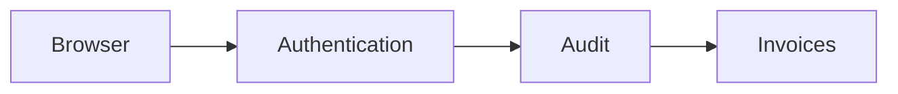
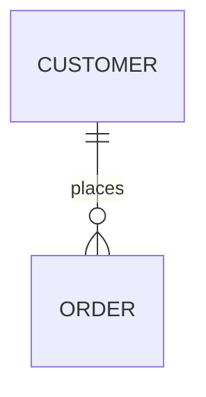
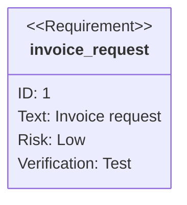
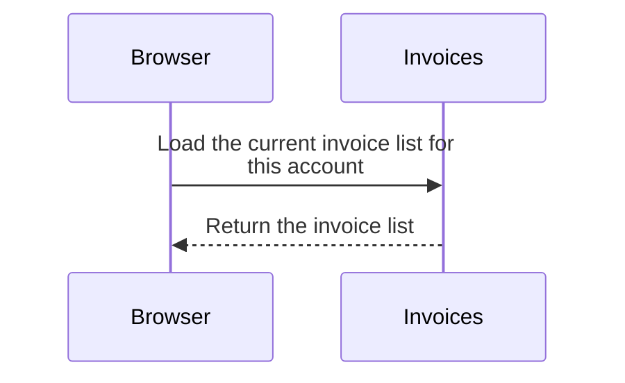

# Team invoices

A server-rendered Express app with a login form and an invoice list.

> This repository is a disposable test fixture for [Observed](https://github.com/esau-morais/observed).

## Develop

```bash
npm install
npm start   # http://localhost:3000 (set PORT to change it)
```

Sign in as `ada`. The demo password is not committed. Developers have it in the
`DEMO_PASSWORD` environment variable, and CI reads it from the `DEMO_PASSWORD`
Actions secret.

## Invoice request



## Entity relationship



## Requirements



## Sequence


