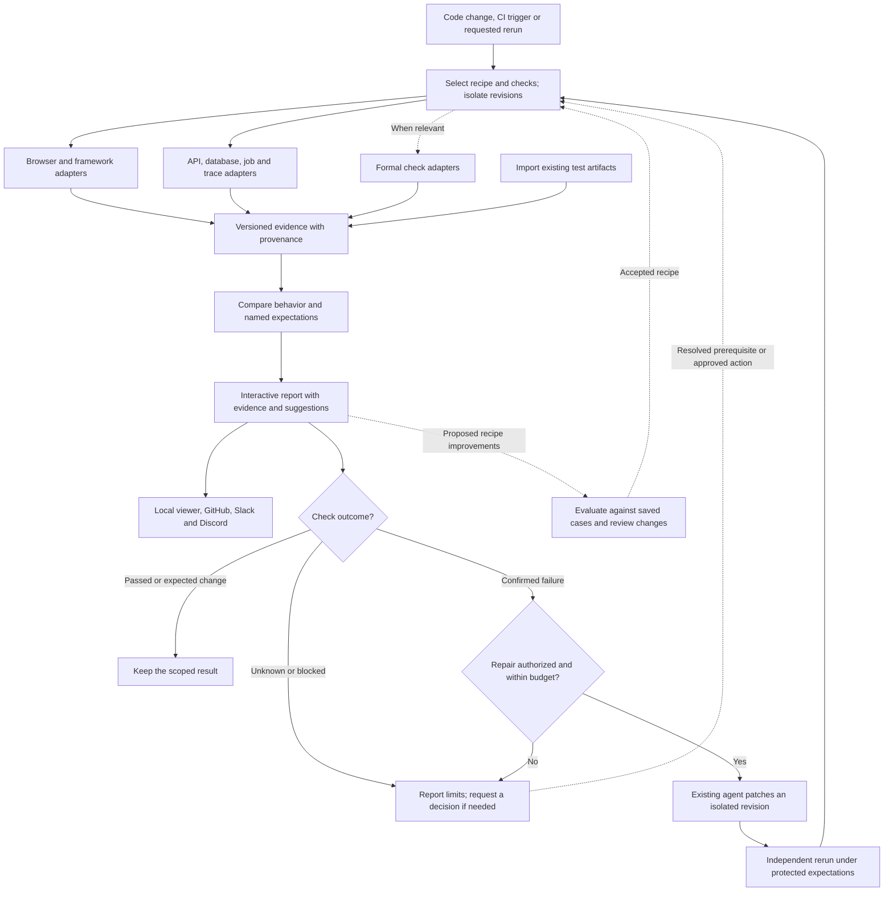

# Observed

See what you just built.

Observed captures the result of a code change in the running app. Preview a new
screen, put two versions side by side, or inspect the requests behind a click.
Your coding agent writes the project configuration and runs captures. You open
the result.

Everything runs locally. Capturing and viewing need no model and no account.

A result covers its named checks on the journeys you saved. It does not say the
whole change or the whole app is correct.

## Install

Observed needs [Bun](https://bun.sh/docs/installation) 1.4.2 or later, on Linux
x64 or macOS, Intel or Apple silicon. Windows and Linux arm64 are not
supported, because Chrome for Testing publishes no Linux arm64 build.

```bash
bun add --global @observed-software/cli
observed setup
```

- `observed setup` downloads the Chrome build used for capture, about 190 MB.
  In a container or another Linux machine without desktop libraries, run
  `observed setup --with-deps`, which also installs packages with `sudo apt`.
- Bun reports one blocked postinstall, from agent-browser. Leave it blocked.
- To run a pinned version without installing it, start each command with
  `bunx @observed-software/cli@<version>`.

## Use it on your app

Run `observed` in your app's directory. It does the setup steps that are
missing, then previews the app:

1. Checks Bun and the browser, and offers the browser download.
2. When `observed.json` is missing or invalid, offers to open your coding agent
   (`claude`, `codex`, `opencode` or `opencode2`) with one message, which tells it to run
   `observed skill` and follow it. The agent runs in its own session under its
   own permission prompts. Observed never reads its settings or credentials.
3. Captures the working tree and opens the viewer.
4. Offers a pull request that runs Observed on every pull request. It commits
   `observed.json`, the workflow and, if the default branch has none,
   `.github/dependabot.yml` to an `observed/setup` branch in a separate
   worktree, and pushes with your Git credentials. Your checkout stays as it
   is. With `gh` signed in, `gh` opens the pull request. Without it, Observed
   opens GitHub's pull request page with the title and description filled in.
   A no is remembered in `.observed/setup.json`.
5. Links to the ruleset settings where you can require the **Observed** check.
   Observed never changes them.

| Flag | Effect |
| --- | --- |
| `--json` | Ask nothing. Print `{ "steps", "next", "run" }` |
| `--agent claude\|codex\|opencode\|opencode2\|prompt` | Pick the agent, or print the prompt for another agent |
| `--yes` | Answer yes to the browser download, the first agent found, and the setup pull request. Give it to an agent only after you agree to those |
| `--dry-run` | Print the remaining steps and change nothing |
| `--project <dir>` | Run for another directory |

Without a terminal, `observed` asks nothing and prints the next step.

### Commands

| Command | Does |
| --- | --- |
| `observed observe --json` | Capture the working tree |
| `observed observe --base HEAD --json` | Compare the working tree with a commit |
| `observed view [directory]` | Open a report, or the latest run of an app |
| `observed skill` | Print the guide a coding agent follows, with every command pinned to this version |
| `observed schema` | Print the JSON Schema for `observed.json` |
| `observed import playwright <report>` | Read a Playwright report Observed did not run |
| `observed <command> --help` | List every option |

Pass the app's directory as an argument to run from elsewhere. Without
`--json`, `observe` opens the viewer and runs until you press Ctrl+C. The JSON
output's `directory` is the report, and `observed view <directory>` opens it
again.

| Exit code | Meaning |
| --- | --- |
| `0` | Completed: no regression, not checked, or preview |
| `1` | Unavailable: a revision or capture could not be used |
| `2` | A named check failed or regressed |
| `3` | Bare `observed` stopped at a setup step |

When Observed rejects `observed.json`, it prints no JSON and lists every
problem on stderr.

Evidence goes to `.observed/` in the app's directory, which holds its own
`.gitignore`. `--output` writes to another directory. Each capture, from setup
through the journey, must finish within `--timeout` milliseconds, 120000 by
default.

### Write observed.json

The [project schema](src/project.ts) and
[step and check schema](src/capture/recipe.ts) list every field.

#### Source and commands

- `source.paths` lists every file or directory the app needs to build and run,
  including lockfiles, relative to the directory that holds `observed.json` and
  without `..`. An app that needs sibling directories, such as monorepo
  packages, puts `observed.json` in a common parent. `source.entry` names one
  of the listed files.
- Observed copies only those paths into a temporary directory, from the
  revision being captured or from the working tree. It skips gitignored files,
  `node_modules`, `dist`, `build`, `.git`, `.env*`, and credential and key
  files, so `setup` must recreate build output. Symlinks are rejected.
- `setup` commands run in order inside that copy. Each is an argument array
  with no shell. Use `["sh", "-c", "..."]` when you need one. They see only
  `PATH`, `HOME`, `LANG` and `TZ`.
- `start` is one command that keeps the app running. It receives `PORT` and
  `HOST=127.0.0.1`, and Observed replaces `{port}` in its arguments. Its only
  other variables are `PATH`, `LANG`, `TZ` and `HOME`, which is the copy. Set
  anything else, such as `NODE_ENV`, inside an `sh -c` command. The app must
  listen on `127.0.0.1` at that port.
- An app with several processes, such as a frontend and a separate API, starts
  the real ones from one script or `sh -c` command. Don't write a replacement
  server, because Observed would capture the replacement. A service on a fixed
  port works, since base and candidate run one after the other. Add its origin
  to `capture.allowedOrigins`.
- `ready` is a path and status that Observed polls until the app answers. It
  doesn't follow redirects, so pick a path that answers with that status
  directly, such as `/login` with 200 rather than `/` with 302.
- `--base` captures that commit's copy of `source.paths` with the working
  tree's `observed.json`. A start script that exists only in the working tree
  makes the base capture fail, so commit it before comparing.

#### The journey

- Name the journey after the person's action, such as "Load items". The
  report and the pull request comment use this name.
- The browser opens `capture.path` and runs `capture.ready` without recording
  requests. It records requests during `capture.steps`, the journey under
  test. To record the page load itself, start `steps` with a `navigate` step.
- A request during `steps` to an origin outside the app and `allowedOrigins`,
  such as a font CDN or analytics, fails the capture.
- To capture more than one journey, replace `capture` with `journeys`, a list
  of one to three objects shaped like `capture`, each with a unique `name`.
  Each journey is its own capture of each revision, with its own setup and app
  start, so three journeys take about three times as long. `--timeout` applies
  to each capture. `observed capture` takes the first journey, or the one
  named by `--journey`.
- A journey's optional `collectors` list records more evidence after `steps`.
  Checks add the collectors they need. The
  [evidence kinds](src/evidence-kinds/index.ts) list what can be collected.
  Every journey records which source lines ran, through a second run of the
  journey; `{ "kind": "coverage", "enabled": false }` turns that off.
- Sign in with a disposable account from committed seed data. `setup` doesn't
  receive fill variables, so commit the account with its password hash and
  pass the password through a fill variable, such as
  `{ "env": "LOGIN_PASSWORD" }`. Observed can't complete a second factor, so
  give that account none.
- Ubuntu 23.10 and later, including GitHub's `ubuntu-24.04` runners, block
  Chrome's sandbox, and Chrome exits with "No usable sandbox". There, set
  `capture.browserArguments` to `["--no-sandbox"]`.

#### Checks

`capture.checks` is an optional list of named checks. Each has a unique `id`,
a `name` and a `scope` that says what it covers. `capture.check` still accepts
a single check. Set one or the other.

Name each check after the behavior it protects, such as "Each Load items click
sends one item request". The pull request comment leads with the name of each
failed or unknown check, so the name tells a reviewer what broke.

| Kind | Passes when |
| --- | --- |
| `request-count` | The requests during `steps` that match its method and path number `expectedCount`, and all answered `status`. It counts the app's origin, or the check's `origin`. The path is compared without query string or fragment, so the check's `path` can't contain `?` or `#` |
| `text` | Exactly one element matches its selector and its text equals `expectedText` |
| `browser-errors` | No uncaught page error or `console.error` happened during `steps`. Optional `ignore` holds regular expressions matched against the first line of each error |
| `accessibility` | The candidate has no axe-core violations at or above `impact` that base doesn't have. `impact` is `minor`, `moderate`, `serious` or `critical`, and defaults to `serious`. It needs a base, so it doesn't run in a preview |
| `react-renders` | The component named in `component` renders at most `maxRenders` times during `steps` |
| `performance` | One metric's median stays within `max`, and within `maxIncreasePercent` of the base |
| `api-status`, `api-schema`, `api-readback` | An operation sent by the `api` collector answered as expected |

The run concludes regression if any check regressed, check failed if any check
failed, and unavailable if any check is unknown. Otherwise it concludes no
regression.

- Put the expected result in the check, not in a step. A step that waits for
  the expected text times out when the app regresses, and the run reports
  unavailable where it should report a failed check. Wait for something both
  versions show, such as the table rows, then check the value.
- A `react-renders` check can name a component only when the build keeps
  names. Vite 8 keeps them with
  `build: { rolldownOptions: { output: { keepNames: true } } }`, and Vite 7
  with `esbuild: { keepNames: true }`.
- Observed points errors and React findings at source lines, and counts
  the lines that ran, through source maps. Build with
  `build: { sourcemap: 'hidden' }` in Vite, or your bundler's equivalent.
  Without a map, Observed matches a name only where the diff defines it, and
  otherwise records why it has no line.
- The conditions that make each check unknown, and the Playwright,
  performance, coverage and API collectors, are described in
  `docs/CONFIGURATION.md` in the Observed repository.

### Checks and collectors in detail

The [React example](examples/request-lab/observed.json) and the
[plain browser example](examples/shop/observed.json) are complete files.
[docs/CONFIGURATION.md](docs/CONFIGURATION.md) covers what each check counts
and when it is unknown, the evidence every capture records, Playwright tests,
browser performance, API operations, secrets, and importing results.

## Run on pull requests

The GitHub Action captures your saved journeys on the pull request's base and
candidate in one job, compares them, and puts the result on the pull request.
The first pull request already gets a comparison. It needs a committed
`observed.json` and an `ubuntu-24.04` or `macos-15` runner.

Bare `observed` offers to open a pull request with this workflow. To add it by
hand, create `.github/workflows/observed.yml`:

```yaml
name: Observed

on:
  pull_request:

permissions:
  contents: write       # check out, and store the screenshot crops the comment shows
  checks: write         # title this job's check with the verdict
  pull-requests: write  # post and update one comment

concurrency:
  group: observed-${{ github.event.pull_request.number }}
  cancel-in-progress: true

jobs:
  observed:
    name: Observed
    runs-on: ubuntu-24.04
    timeout-minutes: 15
    steps:
      - uses: actions/checkout@3d3c42e5aac5ba805825da76410c181273ba90b1 # v7.0.1
        with:
          fetch-depth: 0
          persist-credentials: false
      - uses: esau-morais/observed@b19393c598268adb68c3d90cdf92f0e683c216ee # v0.2.0-alpha.5
        with:
          project: .
          base: ${{ github.event.pull_request.base.sha }}
```

The action uses the workflow's own token. It needs no GitHub App, secret or
variable. The job's result is the verdict, with the exit codes above: `0`
passes the job, `1` and `2` fail it.

- Keep the `pull_request` trigger. Never use `pull_request_target`, which
  gives pull requests from forks the repository's secrets and a write token.
- Observed captures both revisions with the candidate's `observed.json`. The
  base's file judges each check it defines, and a journey whose steps or other
  fields changed leaves its checks unknown. Relaxing a check in
  `observed.json` therefore cannot turn a fault into a pass. An imported
  Playwright test is judged by the candidate's test file, labeled when that
  file changed. The comment names each added, removed and altered check, with
  the candidate's version beside it as proposed.
- The action installs Bun and the browser. When `setup` or `start` needs
  another toolchain, such as Go, Python or Node.js, install it in a step before
  Observed's.

Each run titles the job's check with the verdict, posts one comment that later
runs edit, and links the report. The comment includes a prompt for your agent
built from the result. To require the result, add the **Observed** check to a
branch ruleset.

[docs/GITHUB.md](docs/GITHUB.md) covers the action's inputs, pinning and
upgrades, secrets, forks and Dependabot, the report and artifacts, signing
comments with your own GitHub App, Slack and Discord, and turning it off.

## The planned complete flow

This is the intended final state. Browser capture, comparison, named checks,
API operations, the report, GitHub, Slack and Discord delivery, and test import exist
today.

Not built yet: coverage of the files a change touched, protecting
expectations from the change that edits them, generated journeys, repair,
requested reruns, model routing, and database, job, trace and formal
adapters.



## Develop Observed

```bash
git clone https://github.com/esau-morais/observed
cd observed
bun start        # install, capture the Request lab example, open the viewer
bun run check    # typecheck, lint, unit tests and build
bun run verify   # capture and viewer tests against both example projects
```

In a checkout, `bun run observe`, `bun run setup` and `bun run view` run the
CLI from source. Use `bun run test`, not `bun test`.
[AGENTS.md](AGENTS.md) holds the contributor rules, and
[Architecture](docs/ARCHITECTURE.md#verifying-observed) explains how Observed
observes and verifies itself.

## Project documents

[Product](docs/PRODUCT.md) · [Architecture](docs/ARCHITECTURE.md) · [Roadmap](docs/ROADMAP.md) · [Configuration](docs/CONFIGURATION.md) · [GitHub, Slack and Discord](docs/GITHUB.md) · [Design](DESIGN.md) · [Changelog](CHANGELOG.md)

Self-observe documentation-only verification probe.
