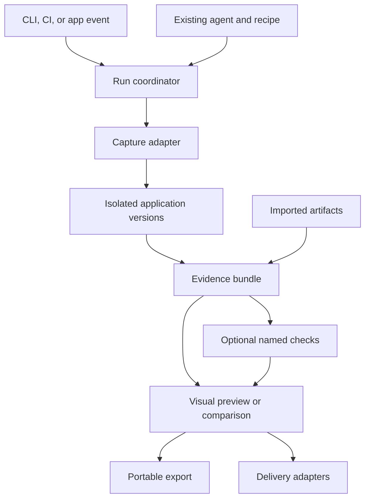
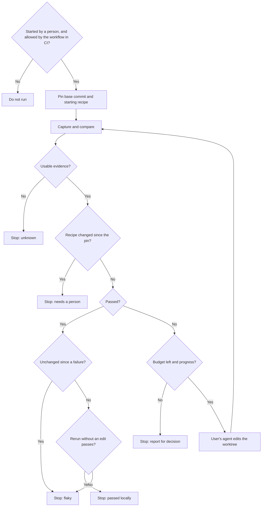

# Observed architecture

A project tells Observed how to start the app and what to capture. Observed keeps
the source identity and evidence together so the result can be opened later.

[Product](PRODUCT.md) covers the experience; [Roadmap](ROADMAP.md) covers sequence.
[AGENTS.md](../AGENTS.md) contains stack and contributor rules.

## Structure

Use one TypeScript project with capture, comparison, report, and shared-schema modules. Keep the CLI thin. React renders the viewer; it does not enter core evidence types. Split packages only when a second consumer needs a public boundary.

The coordinator starts and stops owned processes and records each run. Adapters
translate browser output. The comparator checks compatible captures and any saved
expectations. The viewer works without an agent.

## Project boundary

Parse a saved project configuration at the CLI boundary. It identifies source
files and revisions, argument-vector setup/start commands, readiness, the browser
journey, and named expectations. Commands are trusted project inputs; page content
and evidence cannot supply commands. Run from isolated source snapshots and pin
one recipe before capture. A comparison uses that same recipe on both sides.
Record the exact bytes used.

The collector executes that recipe. The comparator reads verified observations
and the recorded expectation contract; it imports no application fixture or
browser adapter. Application routes, data, frameworks, and build tools belong to
project configuration and test applications. Keep fixture-specific assertions in
integration tests using the public runner.

Read `observed.json` from the base revision as well as the candidate. Capture
both sides with the candidate's journeys so the captures stay comparable, and
record every difference between the two files in the result. Judge a check
that exists on the base by the base's definition. The rules are in
[PRODUCT.md](PRODUCT.md#altered-checks). `observe` reads the base's file
through Git and records the journeys of both files in `selection.json`,
because the comparator reads only capture directories. `compare` has no
repository, so its recipe differences read as unavailable, and the captured
definitions judge the checks.

## Evidence contract

Start with versioned JSON and ordinary artifact files. Preserve raw output; normalize only what the report needs.

| Record | Required information |
| --- | --- |
| Change | Repository, base, candidate commit or snapshot, changed files with their relation to evidence, recipe differences, supplied intent |
| Recipe | Stable ID, version or hash, setup, journey, fixtures, expectations, cleanup |
| Run | ID, revision, recipe hash, producer versions, Observed version and source commit, environment, timestamps, completion |
| Evidence | Run and step IDs, kind, producer, value or artifact reference, hash, conditions |
| Check | ID and version, expectation, evidence references, method, result, missing prerequisites |
| Explanation | Claim, supporting evidence IDs, author or model, explicit inference label |

Use explicit links and adapter extension payloads. No graph database or universal ontology is needed. Add SQLite when queryable history, queues, or deduplication justify it. Preserve portable export.

Hashes detect changed artifacts; they do not establish collector honesty. A stack trace can associate a source location with an error. Temporal proximity cannot prove that a changed line caused a slowdown. Expose missing mappings and inferred relationships.

### Change scope

Built for result schema version 8, without coverage collectors.

The comparator writes the change scope to `result.json` with the result.
Delivery adapters and the viewer render it and never compute or adjust it.

1. Changed files come from the two source snapshots, which already hash every
   captured file. Files that Git reports as changed outside `source.paths` are
   listed as outside the captured source. `observe` records those names in
   `selection.json`, because the comparator reads only capture directories.
   `compare` has no repository, so it reports them as unavailable. Without a
   base snapshot the scope is unavailable, with the reason. Paths stay
   relative to the project, as in the snapshots. The Git listing records the
   project's directory. The pull request comment, job summary, check run, Slack
   and `report.md` join the two and show paths from the repository root. The
   viewer still shows project-relative paths.
2. A file's relation comes only from recorded evidence. No record means "not
   observed". A file that no collector can execute, such as a stylesheet or a
   type declaration, is "not observed" with that reason.
3. Recipe differences come from comparing the base and candidate
   `observed.json` by journey name and check ID.

Relations, strongest first:

| Evidence on a file | Relation |
| --- | --- |
| An anchor from a stack frame, component source, or test location, on a finding that lists a check | Checked |
| Coverage shows a line in scope ran | Exercised |
| An anchor on a finding that lists no check | Exercised |
| A name match against the diff | Exercised at most, labeled as a match |
| None | Not observed |

The wording and the rules for altered checks are in
[PRODUCT.md](PRODUCT.md#change-scope).

Coverage collectors supply the "exercised" relation. The browser collector is
built, as [CONFIGURATION.md](CONFIGURATION.md#browser-coverage) describes.
Probes on 2026-09-29 showed that each source below returns execution counts.

| Runtime | How | Known limit |
| --- | --- | --- |
| Browser | agent-browser 0.38.1 and 0.38.2 have no coverage command (their help and release notes, checked 2026-10-03). agent-browser prints the browser's DevTools address (`get cdp-url`), and a second DevTools client takes [precise coverage](https://chromedevtools.github.io/devtools-protocol/tot/Profiler/#method-startPreciseCoverage) on the page | On the bundled React example, ranges resolved through the source map to the original files. StyleX's build step drops its map, which shifts the `App.tsx` lines; the collector leaves such a file out. One run with the second client and one without recorded the same 7 HAR entries and 2 React renders |
| Node server | The same protocol through `--inspect` | Probed on a small JavaScript server. TypeScript and source maps are untested. `NODE_V8_COVERAGE` wrote nothing when the process was stopped with SIGTERM |
| Bun server | Bun's inspector has no `Profiler` domain. `Runtime.enableControlFlowProfiler` and `Runtime.getBasicBlocks` report executed blocks when the server starts with `--inspect-wait` | Offsets are in Bun's transpiled output. Mapping them to source lines is untested, and Bun stays in scope only if it works |
| Other runtimes | A collector per runtime | Not probed. Their files stay "not observed", with that reason |

- Start coverage before the journey's first navigation, or before the server
  loads its code, so code that runs during load counts.
- Attach to the page target by its address. The first page target can be the
  browser's own new-tab page.
- Map ranges to source lines through source maps, then intersect them with the
  changed lines. A map that embeds a copy of a file different from the
  snapshot gives no lines for that file, because its line numbers count the
  lines of another text.
- Run coverage in the separate browser session, never in the one that takes
  timing samples, because instrumentation changes timing.
- Server coverage changes how the app starts. It applies only when the
  project's `start` runs Node or Bun, and the run records that it did.

### Change map data

Built for result schema version 8 as `changeMap`, next to `changeScope`.
The repository map is not built.

The comparator writes the map's blocks and connections to `result.json` with
the change scope. Every connection lists the evidence it came from: the
report path of a verified artifact, or a journey's finding by its ID. A
snapshot file that fails its integrity check gives no import connection. The
viewer lays out and draws the map and never adds a block or a connection.

- Imports come from `Bun.Transpiler.scan` on each JavaScript or TypeScript
  file in a snapshot, resolved with `Bun.resolveSync` against that snapshot.
  A probe on 2026-10-03 with Bun 1.4.2 returned the four imports of the
  Request lab's `App.tsx` and resolved all four. The map draws the
  candidate's imports and marks the imports the change removed. Files in
  other languages have no import connections, and the map says so. The scan
  drops type-only imports and keeps dynamic `import()` calls with a literal
  path.
- `Bun.resolveSync` installs a package it cannot find: on 2026-10-03 with
  Bun 1.4.2, resolving `left-pad` from a directory without it downloaded the
  package into Bun's cache. The comparator therefore resolves only relative
  specifiers and those matching a `paths` alias in a `tsconfig.json` or
  `jsconfig.json` of the snapshot, taken from the config nearest the
  importing file as Bun does. A wildcard alias counts only when `*` follows a
  slash, as in `@/*`, so a key such as `@*` cannot pass scoped package names
  to the resolver. It does not follow `extends`. Any other
  specifier is a package block named after the package.
- Layout is presentation, not evidence. The viewer shows one directory at a
  time and lays it out with its own layered layout in
  `src/viewer/map-layout.ts`: rows from the import order, a row wraps at the
  available width, and long edges run through shared lanes. The same level at
  the same width always gives the same picture.
- A repository map is a single capture's scope over every file in
  `source.paths`.

Agent descriptions are explanation records from the
[evidence contract](#evidence-contract). Observed validates the file with a
schema, rejects a description that names a file outside the snapshot, redacts
it like any artifact, and renders it as text.

### Replay

Planned for Phase 3a. Not built.

The capture records each side with `agent-browser record start`. The help
text of `agent-browser record` in 0.38.1, read on 2026-10-03, says it
"Requires ffmpeg on PATH with the libvpx and libx264 encoders". A probe that
day found that the PATH that counts is the one the session's daemon started
with. With ffmpeg missing from it, `record start` exited 1 with "ffmpeg not
found or failed to execute". Then the replay is unavailable, with that reason,
and nothing else changes. Captions come from the action timeline's steps and
their times.

Record the session that produced the checked evidence, so the replay shows the
run that the verdict describes. Recording can change timing, so a journey with
a timing check records its separate coverage session instead, and the replay
is labeled as a separate run.

### Generated journeys

`observe --generated <file>` accepts up to three journeys for one run. The file
has schema version 1. `observed schema --generated` prints its schema.

An agent supplies generated journeys for one run in a file of their own.
Observed validates them with the journey schema, runs them after the saved
journeys, and records them in the result with their origin. They carry only
baseline checks. They cannot add a check with a written expectation, change a
saved journey, or write to `observed.json`.

Locally the person's agent follows the guide that `observed skill` prints.
It runs Observed, reads the scope, writes journeys for what is not observed,
runs again, and stops at the budget. In
CI the same loop needs a configured agent command, which belongs to
[Phase 4](ROADMAP.md#status). Observed treats the file as data. A journey
cannot supply a command.

The file supplies names, paths, ready actions, steps, target files, a reason,
and optional text selectors. It cannot supply collectors, browser arguments,
origins, or check definitions. Each action list has at most 20 steps, and each
journey has at most 10 text selectors. Browser settings come from the first
saved candidate journey. Each capture uses the run's `--timeout`.

A generated recipe records its targets and reason in an optional `generated`
field. The run selection also retains its name and origin when source selection
fails before either capture writes a recipe. Its three check definitions are
fixed and validated again when the recipe is read. The new browser-error and
server-error baseline kinds are reserved for generated recipes; saved
configuration retains its existing check kinds. The optional field is an
additive extension of recipe schema 2 and result schema 9. An older reader that lacks the baseline check kinds
rejects the recipe rather than treating it as a saved journey.

Browser errors and the generated request window include initial navigation and
readiness. Generated captures start request recording on a blank page before
the first application navigation; saved request windows still start after
readiness. Browser error signatures
normalize the application's local port. The server check compares counts of
500-or-above responses by method, origin, and pathname. The request ledger
does not distinguish query values or request bodies, so neither does this
check. Accessibility uses the existing serious-or-higher baseline comparison.
Missing or incompatible evidence leaves these checks unknown or not run.

Comparable text evidence lists changed values for selectors that identify one
element on both sides. These findings carry no check IDs or verdict, even when
the screenshots are identical. Missing or ambiguous elements remain in the
raw evidence and do not support a text-difference finding.

The comparator adds a saving proposal only when a recorded coverage connection
shows changed lines ran in that journey. Three saved journeys make the proposal
a replacement; otherwise it is an addition. No proposal writes a project file.
The remaining change scope retains files not observed, including files for
which coverage is unavailable.

### Source anchors

The collector or importer gathers what anchors need, such as source maps and test locations. Each finding's anchor is resolved from those artifacts and recorded in `result.json` with the result. Delivery adapters and the viewer render anchors; they never compute or adjust them. Each anchor records its basis and whether its line was added, removed, or unchanged in the base..candidate diff.

Resolve anchors in this order:

1. Locations the evidence carries: stack frames and component positions resolved through source maps, and test locations from a test report. The collector follows `sourceMappingURL`, or fetches `<script>.map` for a hidden map, and keeps the maps as artifacts. Maps can embed source text, so redact them like any artifact before export.
2. Name matching against the lines the base..candidate diff changed, such as a component, element id, or route. This basis is weaker and is recorded as a match, not a resolution.
3. Otherwise no anchor, with the reason recorded. Never guess a line.

## Comparable and safe runs

- Snapshot the selected source, including intended worktree changes and untracked files. The snapshot hash identifies a worktree capture; its HEAD commit is recorded as context. Pin the base when comparing versions. Exclude credentials and unrelated ignored data.
- Observed derives observations from producer output, so captures from different Observed versions are not comparable. Under one version, differing or unknown Observed commits and uncommitted tracked changes to Observed leave the pair comparable and appear as limitations. Changes inside the captured project's directory do not count as Observed changes. Recapture a manifest written under an older capture schema; it is reported unavailable, not upgraded.
- Isolate ports, browser profiles, processes, fixtures, and writable directories. Otherwise serialize and reset shared state. Record limitations.
- Match browser, viewport, environment, recipe, and fixture versions when comparing. Record deliberate masks and incompatible baselines. A requested but missing baseline is unavailable. A standalone preview needs no baseline.
- Warm up timing checks, repeat samples, record spread, and alternate run order where practical. Configure meaningful thresholds and noise handling. Keep intrusive profiling separate from timing gates.
- Let one adapter own a browser session. Declare capabilities and versions. Unsupported evidence must not look like an empty success.
- Keep captures immutable. Redact secrets before export or model access. Validate imported schemas and artifact paths. Treat captured content as data, never executable instructions.
- Validate revision identity before publishing or acting. Make repeated events idempotent. Preserve failed runs and classify flaky outcomes instead of retrying until green.

## Reuse and adapters

Use a thin [agent-browser adapter](https://github.com/vercel-labs/agent-browser) first. Existing Playwright tests run or import as imported checks, each labeled "Imported from Playwright". Keep [native trace viewing](https://playwright.dev/docs/trace-viewer).

Evaluate [Chrome DevTools MCP](https://github.com/ChromeDevTools/chrome-devtools-mcp), [agent-react-devtools](https://github.com/callstackincubator/agent-react-devtools), and [React Doctor](https://github.com/millionco/react-doctor) for gaps demonstrated by real failures. Inspect pinned releases, compatibility, telemetry, and required data access before adoption. Do not run competing collectors merely to support more tools.

Later backend adapters import concrete operation results: response contracts, database readbacks against disposable fixtures, and job events. Preserve [OpenTelemetry trace IDs](https://opentelemetry.io/docs/concepts/signals/traces/) and link to existing storage instead of collecting all production telemetry.

### Delivery adapters

A delivery adapter posts one run's `result.json` to one place: a code host
such as GitHub, or a chat such as Slack or Discord. Every adapter renders the
same result and never recalculates it. The verdict, the check count, the
change scope and the anchors come from the result. The headline and count
wording are shared, and so is the chat rule of posting when a pull request starts failing, editing
afterwards and replying on recovery. An adapter owns its transport, escaping,
length limits and the identity of the message it edits. Chat adapters keep
that identity in a hidden marker in the pull request comment.

A code-host adapter needs five things from its platform: a job that runs on
the pull request with the base and head commits, one comment it can find and
edit, a status that carries the verdict, a place to store the screenshot crops
so the comment can show them, and a write token that untrusted code never
reads. [t3code](https://github.com/pingdotgg/t3code/blob/main/apps/server/src/sourceControl/SourceControlProvider.ts)
splits hosts the same way, as of 2026-10-02. It picks one provider per host
from the remote URL, and a host can leave out optional capabilities. The GitHub code moves behind such an
interface when a second host lands, not before.

| Platform | Limit that shapes the adapter | Source, checked 2026-10-05 |
| --- | --- | --- |
| GitLab | `CI_JOB_TOKEN` can read but not write merge request notes and commit statuses, so the comment needs a project access token. On GitLab.com those need Premium or Ultimate. Fine-grained job token permissions were not checked | [Job token](https://docs.gitlab.com/ci/jobs/ci_job_token/), [project access tokens](https://docs.gitlab.com/user/project/settings/project_access_tokens/) |
| GitLab | A fork's merge request pipeline runs in the fork without the parent's variables. Running it in the parent exposes every variable to the fork's code | [Merge request pipelines](https://docs.gitlab.com/ci/pipelines/merge_request_pipelines/) |
| GitLab | Uploads return Markdown and anyone with the URL can view them, unless a maintainer requires authentication for media | [Uploads API](https://docs.gitlab.com/api/project_markdown_uploads/), [user file uploads](https://docs.gitlab.com/security/user_file_uploads/) |
| GitLab | One note per merge request through the notes API, up to 1,000,000 characters. A failing job is the status; external status checks need Ultimate | [Notes API](https://docs.gitlab.com/api/notes/), [status checks](https://docs.gitlab.com/user/project/merge_requests/status_checks/) |
| Azure DevOps | Azure Repos runs pull request builds through the Build validation branch policy, not YAML `pr:` triggers. The build checks out the merge commit | [Azure Repos Git](https://learn.microsoft.com/en-us/azure/devops/pipelines/repos/azure-repos-git?view=azure-devops) |
| Azure DevOps | `System.AccessToken` must be mapped into the step's environment, and the build service identity needs Contribute to pull requests | [Access tokens](https://learn.microsoft.com/en-us/azure/devops/pipelines/process/access-tokens?view=azure-devops) |
| Azure DevOps | One thread found by its `properties`, edited through the comments API. A pull request status carries the verdict | [Threads](https://learn.microsoft.com/en-us/rest/api/azure/devops/git/pull-request-threads/create?view=azure-devops-rest-7.1), [statuses](https://learn.microsoft.com/en-us/rest/api/azure/devops/git/pull-request-statuses/create?view=azure-devops-rest-7.1) (REST 7.1) |
| Azure DevOps | Pull request attachments need the `vso.code` scope to read. The docs do not say whether a reader who is not signed in sees the image | [Attachments](https://learn.microsoft.com/en-us/rest/api/azure/devops/git/pull-request-attachments/create?view=azure-devops-rest-7.1) |
| Azure DevOps | For a GitHub repository, builds of forks get no secrets and a restricted token by default. Organizations created since September 2023 also stop building fork pull requests automatically | [GitHub repositories](https://learn.microsoft.com/en-us/azure/devops/pipelines/repos/github?view=azure-devops) |
| Discord | A webhook can edit its own messages but cannot reply, so Observed posts as a bot. An edit lists every attachment to keep. Mentions stay off only when each request sends `allowed_mentions` | [Webhooks](https://docs.discord.com/developers/resources/webhook), [messages](https://docs.discord.com/developers/resources/message) |
| Discord | A 429 answer gives `retry_after` in seconds. Observed waits once for up to 10 seconds, then reports the limit | [Rate limits](https://docs.discord.com/developers/topics/rate-limits) |

Delivery adapters bind remote actions to repository, authenticated user, permitted action, and current revision. Recheck authorization at execution. A casual reply is not permission to merge or modify production data. Acknowledge long jobs before running them and retain their job identity.

On GitHub, delivery uses the job's own token, scoped by the workflow's `permissions:` and valid only while the job runs. Capture needs no write token, and the capture step's environment gets no GitHub token. Delivery writes only the job's own check run and one comment. An optional user App token is minted after capture and only signs the comment, since only the App that created a check run can update it. Exchanging an Actions OIDC token for an App token needs a hosted service, so any such exchange stays outside core and optional.

Line delivery is planned and not built. On GitHub, every anchored finding becomes a check-run annotation. A review comment is reserved for a regression or new error anchored by a stack frame, component source, or test location; a name match never gets one. Post one review per run, find earlier comments through a hidden finding ID, and reply and resolve the thread when its finding clears instead of posting again.

### Scene export

When a check failed, the action exports the viewer's before-and-after scene as a GIF and stores it like the screenshot crops, under `refs/observed/crops/` with a `-scene` suffix, and pruned with them. The comment shows it above the check rows, and Slack gets it in the failing message's thread when `slack-images` is on. The export opens the run's single-file report in agent-browser at `#scene-frame=<step>/<progress>`, screenshots each frame at 960 by 540, and encodes them with `src/gif.ts`. The GIF plays once and stops on the code frame, or on the verdict when the evidence points at no source line. A GIF has no sound, and GitHub shows video in a comment only through a user's upload ([attaching files](https://docs.github.com/en/get-started/writing-on-github/working-with-advanced-formatting/attaching-files)).

Rendering tools compared on 2026-10-05:

| | Remotion 4.0.532 | HyperFrames 0.8.127 | agent-browser frames and `src/gif.ts` |
| --- | --- | --- | --- |
| License | Source-available. Companies above three people need a paid license, and a program that renders is an "automation" billed per render, so each user organization rendering in its CI would need one ([license](https://github.com/remotion-dev/remotion/blob/main/LICENSE.md), [FAQ](https://www.remotion.dev/docs/license/faq)) | Apache-2.0 ([repository](https://github.com/heygen-com/hyperframes)) | MIT, this repository |
| On a CI runner | Downloads Chrome Headless Shell, bundles FFmpeg | Node.js 22 or later and FFmpeg ([README](https://github.com/heygen-com/hyperframes#readme)), and Chrome | agent-browser and Chrome, already installed for capture |
| Formats | MP4, WebM, GIF, PNG sequence | MP4, MOV, WebM, GIF, PNG sequence | GIF |
| Install, measured with `bun add` | 245 packages, 316 MB | 74 packages, 141 MB | none |
| Reuse of the scene | A composition wrapper and Remotion's bundler for StyleX | Its engine seeks a page that exposes `window.__hf` ([engine](https://hyperframes.heygen.com/packages/engine)) | The report page as built |

Runtime dependencies stay limited to agent-browser, so neither tool ships in the package. HyperFrames is the one to revisit if MP4 or WebM is needed, for example for narration, as an optional pinned step. For the three-step trial journey on `observed-trial-express`, the export made 41 frames: 5.1 s and 444 KB on a Linux laptop, and 7.6 s and 505 KB in the action's step on an `ubuntu-24.04` runner.

Narration is not built. Kit Langton makes the explainers with [psychopomp](https://github.com/kitlangton/psychopomp). At 46fd612, read 2026-10-05, its default walkthrough narration uses Fish Audio, and a study in `scenes/pr-walkthrough/narration-v4/README.md` used an ElevenLabs Professional Voice Clone named `Kit Langton`, directed with bracketed cues. Neither file says which voice the published post used, and the post's replies could not be read. Observed would use only a stock voice or one the user supplies, never a clone of someone else. A narration track stays optional, and the scene stays complete with captions alone. The default script would be the captions' evidence sentences; a script an agent writes is interpretation and carries that label. Stock voices with whisper-to-shout control exist in [ElevenLabs v3 audio tags](https://elevenlabs.io/docs/best-practices/prompting/eleven-v3) and [Azure SSML speaking styles](https://learn.microsoft.com/en-us/azure/ai-services/speech-service/speech-synthesis-markup-voice). [Kokoro-82M](https://huggingface.co/hexgrad/Kokoro-82M) runs offline under Apache-2.0, without that control.

### Rendered diagrams

Planned, after the gate 3 and gate 8 pairs land. When a comparison's changed
files include Markdown whose `mermaid` fenced blocks differ, Observed reads
each file from the base and candidate commits with Git, pairs the blocks by
the nearest heading and their order under it, and renders each changed pair
in agent-browser's Chrome. The page loads a pinned `mermaid` build bundled into
`dist/` like the viewer, so the package gains no runtime dependency. The result
records each pair as an observation with both commits, the file path, the
mermaid version as the producer version, and an SVG and PNG for each side that has the block. A block
that does not parse renders as unavailable on that side, with mermaid's error.
A block with no partner was added or removed: the result renders the side that
has it and marks the other side absent, which is not an error.

Diagrams render whether or not the file is in `source.paths`, since docs
usually sit outside it. They never enter the change scope, a check, or the
verdict. The comment shows each pair under the scope line, labeled
"Observation", and a pull request whose diagrams did not change shows nothing
for them.

Prior art read on 2026-10-05. GitHub renders `mermaid` blocks in Markdown
([creating diagrams](https://docs.github.com/en/get-started/writing-on-github/working-with-advanced-formatting/creating-diagrams))
and highlights prose changes in its rendered diff, without saying whether that
diff renders diagrams
([non-code files](https://docs.github.com/en/repositories/working-with-files/using-files/working-with-non-code-files)).
[Read the Docs visual diff](https://docs.readthedocs.com/platform/stable/visual-diff.html)
highlights changed sections without gating, on its hosted service.
[CodeBoarding](https://github.com/CodeBoarding/CodeBoarding-action) posts a
before-and-after architecture diagram but needs a model.
[mermaid-cli](https://github.com/mermaid-js/mermaid-cli) renders through an
existing Chrome given its path, which is the approach here. A renderer without
a browser, such as
[beautiful-mermaid](https://github.com/lukilabs/beautiful-mermaid), lays the
graph out differently from GitHub, so its picture would not match what
reviewers see.

The planned `/observed` trigger runs only for a comment from a user with write access on a pull request from the same repository. Untrusted pull request code must never run where the GitHub App key or Slack token can be read. If one workflow cannot guarantee that, split it: an unprivileged capture uploads the result, and a privileged delivery started by `workflow_run` reads only that upload. Never use `pull_request_target`. If neither design is safe, fall back to a label trigger on `pull_request`.

## Code, skills, and AI

Use code for arithmetic, assertions, hashing, permissions, process ownership, timeouts, retries, and state transitions. Use agents to discover startup paths, propose journeys, explain evidence, and suggest fixes.

Project development skills live in .agents/skills with the Claude symlink. Product users do not need this collection. Keep saved checks executable without an assistant. Offer one optional, versioned Observed skill for an existing assistant when setup needs it. Do not silently alter user instructions or build another assistant runtime.

A configured agent command can handle model choice and authentication. Add direct provider support only for an operation that needs it. Jev is an optional experiment, never the authority for measurements, permission, or a passing verdict. See [experiment gates](ROADMAP.md#optional-experiments).

## Verifying Observed

Observed's own pull requests run two observations. One captures the Request lab
example with the pull request's build of Observed: one journey and one
`request-count` check. The other uses the previous release to capture the
report viewer on three saved journeys with six protected checks and three
generated journeys with nine baseline checks, rendered from one stored fixture.
The generated journeys select a file on the map, operate the scene controls,
and open each evidence section present in the fixture.
[tests/fixtures/self-observe](../tests/fixtures/self-observe) explains how to
regenerate it. That job pins the previous release by commit SHA and
never `./`, so the pull request's code is only ever the observed side. After
each release, bump the pin.

Neither job exercises most comparator branches, the collectors for other
evidence kinds, or delivery. Observed records a green self-observation. It
never decides whether Observed is correct.

Independent verification uses expectations that the code under test cannot
change:

- A gate corpus of base and candidate pairs with known outcomes, kept in
  separate trial repositories. Write each expected outcome before the run.
- A checker that compares `result.json` with the expected outcome and with the
  raw producer output, such as the HAR. It imports nothing from the comparator.
- Faults seeded into disposable copies of Observed, such as a missing capture
  that counts as a pass. The unit tests and the gate corpus must fail on each.
- Property-based tests of pure verdict logic, with fast-check once it is
  added. State each property without importing the constant it protects. A
  property that reads the precedence order from the code passes against a
  fault in that order.
- Optional, outside CI: for a small finite model of verdict logic, a proven
  model and a conformance run. The conformance run executes the model and the
  real function on the same inputs and lists every disagreement. Seed a fault
  into the conformance script too, because the script can be wrong.

[ROADMAP.md](ROADMAP.md#mvp-release-gates) lists the gates.

## Verification harness, Phase 4

Planned for Phase 4. Not built.

Observed works around a coding agent and never inside its loop. Claude Code,
Codex, opencode or another agent owns the prompts, tool calls and edits.
Observed owns what decides whether the agent's work counts. It runs the
change, records what happened, holds the base revision's expectations, reruns
independently, and decides when a loop may stop. Verdicts need no model.
Nothing here starts before MVP gates 1 to 8 hold, because a loop is only as
sound as the checks it drives toward. Until then the evidence handoff is the
only repair aid. An agent that proposes a journey cannot also accept it.

A rerun covers the selected checks plus a small required smoke set, and
widens for shared configuration, dependencies, schemas, or uncertain impact.
Periodic full runs estimate what selection misses. Repository policy gates
merges, not report wording.

### Pinned base

The loop pins the base before it starts the agent. A hook pins it on the first
`SessionStart` in a worktree. A pin resolves the revision to a commit SHA and
lives in Observed's state directory outside the repository. Nothing re-pins
while a pin exists, including `SessionStart` on resume, clear or compaction. A
person resets it with `observed pin --reset`, which pins the base again and
records the recipe hashes again. An agent with a shell can run it too, so
`loop.json` records each reset, and the pull request's job, which ignores the
pin, still judges the change. The default base is the merge base of `HEAD`
with the remote's default branch, and `--base` sets another. Revision
arguments that start with `-` are rejected.

The base's expectations judge every check that the base defines, as
[PRODUCT.md](PRODUCT.md#altered-checks) describes. `result.json` already marks
each check whose imported test file changed. After gate 5, recipe differences
cover every field of `observed.json` (see [Decisions](ROADMAP.md#decisions)).

The loop and the hooks also record the hash of `observed.json` and of each
imported test file when they pin the base. A later run whose files differ from
those hashes means the recipe changed since the pin, which in the loop's own
worktree only the agent can do, and the loop stops with "needs a person". That
includes a check the agent adds, because only a person accepts a new check.
The comparison is a stop rule and sets no verdict. A recipe difference that
the person's changes already held before the loop started does not stop it,
and the pull request's job judges that difference as usual. In a hook session
the person and the agent share one worktree, so the hooks cannot tell their
edits apart. A recipe edit the person makes there also stops with "needs a
person" until the person resets the pin.

A stub behind an unchanged `start`, such as a changed package script or
fixture, is a source change, not a recipe difference. The change scope lists
it, and a pass reads "No regression in the named checks" with the files that
were not observed, as [PRODUCT.md](PRODUCT.md#change-scope) words it.

### Loop

`observed loop --agent claude|codex|opencode` or `--agent-command <argv>`.
Running the command is the person's authorization for that loop.

1. Pin the base. Copy the working tree's changes into a new worktree on its
   own branch. The agent works there, and the person's checkout stays as it
   is.
2. Run `observe` into a report directory the loop owns, outside the worktree.
3. Stop by the table below. Otherwise give `agentText` to the agent as an
   argument vector without a shell. Like the MCP `evidence` output, the
   handoff is redacted and labels captured page text as data.
   - `claude -p --output-format json --permission-mode dontAsk
     --allowedTools <list>`, on stdin. The list lets print mode edit files
     and run the named commands without a prompt, and `dontAsk` denies the
     rest. Without a mode, the run can start in `auto`, where a classifier
     approves actions the list does not name and a bare `Bash` entry is
     dropped ([headless](https://code.claude.com/docs/en/headless),
     checked 2026-10-05).
   - `codex exec --json -s workspace-write`, on stdin.
   - `opencode run --file`. The help of opencode 2.0.22 lists no stdin input.
4. When the agent exits, go back to step 2. The loop records the agent's exit
   status and last message and never reads them as a verdict.

`claude -p` runs the hooks in the project and user settings unless `--bare`
is set. So the loop sets `OBSERVED_LOOP` in the agent's environment, and a
Stop hook the person installed sees it and does nothing.

When the agent runs in a sandbox, the loop keeps the report and state
directories outside its writable roots. Codex's `workspace-write` can write to
`/tmp` and `$TMPDIR` unless `sandbox_workspace_write.exclude_slash_tmp` and
`exclude_tmpdir_env_var` are set
([configuration reference](https://learn.chatgpt.com/docs/config-file/config-reference),
checked 2026-10-05). Claude Code's Bash sandbox is opt-in and writes to the
working directory and a per-user temp directory
([sandboxing](https://code.claude.com/docs/en/sandboxing), checked
2026-10-05). That sandbox covers shell commands only. Claude's file tools
follow permission rules, so the loop's `Edit` entries name the worktree only.
The report and state directories therefore go under neither the worktree nor
a temp directory. Without a sandbox, an allowed shell command can reach them.
`loop.json` records which applied.

The first row that matches decides the stop. The loop's exit codes differ
from `observe`'s on purpose: a run that checked nothing, `not-checked` or
`preview`, exits 0 from `observe` and 1 from the loop.

| Stop | Condition | Exit |
| --- | --- | --- |
| Cancelled | SIGINT or SIGTERM, such as when the person's intent changed. The loop stops the agent's process group and the capture, and keeps the worktree and reports | 1 |
| Unknown | A capture, a revision or a prerequisite is unavailable, such as an app that does not start or a missing credential, or the run checked nothing | 1 |
| Needs a person | `observed.json` or an imported test file changed since the pin | 4 |
| Flaky | A run passes after a failure with an unchanged snapshot hash, or the confirming rerun fails | 1 |
| Passed locally | `conclusion.kind` is `no-regression` with at least one check, and a rerun without an edit agrees | 0 |
| Agent failed | The agent exited nonzero or passed its time limit, and the rerun still fails | 2 |
| No progress | The snapshot hash did not change, or the same checks failed with the same measured values | 2 |
| Budget | Two attempts by default, a wall-clock limit, and the agent's cost limit where it takes one, such as `claude -p --max-budget-usd` ([CLI reference](https://code.claude.com/docs/en/cli-reference), checked 2026-10-05) | 2 |

Exit 4 is new. The README's exit code table gains it with the loop. At the
end the loop prints the branch, and the person merges or discards it.

`loop.json`, next to the reports, holds the pinned base and the protection
that applied. For each attempt it holds the report directory, snapshot hash,
conclusion, agent argument vector without environment, agent exit and
duration. Last comes the stop reason.

### Hooks

`observed hook claude-stop` and `observed hook codex-stop` read the Stop
hook's JSON on stdin and run `observe` against the pinned base. After a pass
they run the confirming rerun in the same call. They skip the run when the
snapshot hash already has a final stop. They use the loop's stop table, and
block only while the loop would hand the evidence to the agent, with
`{"decision":"block","reason":...}` and the handoff as the reason. Both agents
send that reason back to the model ([Claude Code
hooks](https://code.claude.com/docs/en/hooks), [Codex
hooks](https://learn.chatgpt.com/docs/hooks), checked 2026-10-05). On any
other stop they let the turn end, print the stop reason, and add it to the
worktree's `loop.json`.

The hooks count their own blocks. Claude Code overrides a block after eight
consecutive continuations, raised with `CLAUDE_CODE_STOP_HOOK_BLOCK_CAP`, and
the count resets each time Claude calls a tool. Codex documents no limit. Both
default to a 600-second hook timeout. A pass and its confirming rerun take
four captures per journey, so the hook's timeout must exceed four times the
journey count times `--timeout`. Codex project hooks need trust through
`/hooks`. Observed prints the hook entry and the command that adds it, and
changes an agent's settings only when the person runs that command.

### MCP server

`observed mcp` serves the [Model Context Protocol](https://modelcontextprotocol.io/specification/2025-11-25)
over stdio, built on `effect/unstable/ai/McpServer` from the pinned `effect`
release. The module is unstable, so each `effect` update rechecks it. The
server speaks revisions 2025-11-25 and 2025-06-18, exposes tools only, for
the reasons in the [decision](ROADMAP.md#decisions), and returns
`structuredContent` against an output schema with the same JSON as text.

| Tool | Input | Output |
| --- | --- | --- |
| `observe` | Project directory; optional `base`, `candidate`, `timeoutMs`, as `observe` takes them | A run handle, plus the `check` output for that run |
| `check` | Run handle | `conclusion.kind` and the exit code it maps to (0, 1 or 2), the name and verdict of each failed, unknown and altered check, and the base commit. Decoded from `result.json` with `comparisonSchema`; nothing recomputed |
| `evidence` | Run handle, optional artifact path | The agent handoff from `agentText`, or one artifact that `result.json` references, redacted as for export |

- The server accepts only handles for runs it executed in the same process,
  and hashes each report when it finishes. A report whose files changed
  since reads unknown. No tool takes a capture or report directory, so a
  hand-written `result.json` gets nothing back in Observed's name.
- The loop and the hooks judge only runs they executed, never an MCP
  result. A client's `base` and `candidate` change what the agent sees, not
  what stops a loop.
- `observe` writes a report and starts processes. `check` and `evidence`
  only read. The annotations say so, with `destructiveHint` set explicitly,
  because it defaults to true. Annotations are hints, and Observed relies on
  none of them.
- Tool output leaves out the full `result.json`. Claude Code warns at 10,000
  tokens of MCP output and stops at 25,000 by default
  ([MCP docs](https://code.claude.com/docs/en/mcp), checked 2026-10-05).
- `observe` sends a progress notification per capture step when the client
  passes a progress token. Cancelling interrupts the run, which stops the
  processes it owns. Codex stops a tool call after 60 seconds by default
  ([Codex MCP](https://learn.chatgpt.com/docs/extend/mcp?surface=cli),
  checked 2026-10-05), below the 120-second default capture timeout, so
  `observed skill` tells Codex users to raise `tool_timeout_sec`.
- No tool writes `observed.json` or a baseline. No tool takes a command, a
  verdict, a check definition or an expectation as input. No output carries
  environment variables, tokens, or a path outside the report directory.
- A tool whose parameters or success schema is not an object with at least
  one key stops the server at startup with `Missing key at ["type"]`
  (`effect` 4.0.0-rc.117, 2026-10-05).

### CI

In CI the loop runs only when the workflow enables it and a person with write
access starts it, under the trigger rules in
[Delivery adapters](#delivery-adapters), and only on pull requests from the
same repository. The loop's job runs the candidate's code next to the agent's
credentials and a `GITHUB_TOKEN` that can push, so that code can read them.
The agent pushes a commit with the job's `GITHUB_TOKEN`. That push starts the
pull request's workflow runs in an approval-required state, and a person with
write access starts them
([GITHUB_TOKEN](https://docs.github.com/en/actions/concepts/security/github_token),
checked 2026-10-05). That approval is the authorization for each judged run,
and it keeps the 2026-09-28 decision to need no GitHub App. The pull request's
job, which holds no agent credentials, judges the commit. Generated journeys
run as a separate mode with the rules in
[Generated journeys](#generated-journeys): the agent writes only the journey
file, and the mode stops at its budget.

### Local results and the CI verdict

A local pass stops the loop or lets the turn end. It never stands in for the
pull request's job, which reruns on its own runner from the pull request's
base and carries the verdict. An agent with a shell can reach the state
directory, the hook configuration and Observed's installation. Claude Code
applies settings edited during a session, which a `ConfigChange` hook can
block, and `--bare` skips hooks
([hooks](https://code.claude.com/docs/en/hooks), [CLI
reference](https://code.claude.com/docs/en/cli-reference), checked
2026-10-05). Agents also cheat by special-casing tests, not only by editing
them ([ImpossibleBench](https://arxiv.org/abs/2510.20270)). The CI run is
separate from the agent's session. It still runs the candidate's `start`
command and code. So local results are evidence for the agent, and the CI run
is the evidence for the merge. A second model's review, an agent's exit 0, or
its own claim of success never sets a verdict. Imported agent claims stay
imported until a controlled run checks them.

## Formal results

A formal result must include its statement, assumptions, toolchain, dependencies, and implementation connection. Reject incomplete proofs and unexpected assumptions. Keep model proof and runtime evidence separate; neither substitutes for the other. The implementation connection is its own executed evidence, such as a conformance run of the code against the model's cases. Without it the result reads "model checked, implementation link open" and the overall verdict is unknown.

Checker defaults differ, so a gate names what it rejects. Lean 4.34.1 exits 0 on a proof that uses `sorry` and only warns; the gate must read `#print axioms` and reject `sorryAx`. Bend 2.0.34 exits 1 on an open or missing proof. Its `--verdict` recheck needs Lean 4.34.0 installed, and `@unsafe` and foreign code fall outside it.
